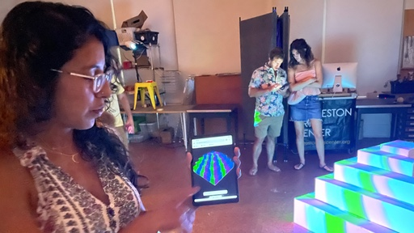

# Common Pastiche
> A community art assignment

This repository contains the source code for a live painting experience using computers and projectors. The code in the `web` directory enables participants to paint the surface of a virtual pyramid. It's written in JavaScript using [three.js](https://threejs.org/), [p5.js](https://p5js.org/), and [Pure CSS](https://purecss.io/). The code in the `rpi` directory synchroinzes a set of projectors that project paintings onto the surface of a real pyramid. It's written in Python and uses the [py5](https://py5coding.org/) and [Keystone](https://github.com/davidbouchard/keystone) packages. [Firebase](https://firebase.google.com/) is used for messaging and image storage.

## A little background

The *Common Pastiche* project was funded by the City of Galveston's Cultural Arts Commission in July 2022. Its first run was held at the Galveston Arts Center in August 2023. Thanks CAC and GAC! The idea evolved through conversations with friends about perception and ways that technology can help us to understand each other. Early iterations focused on style transfer and "seeing" the world through the eyes of others. This led to more research on empathy.

The word "empathy" was created in the early 20th century as a model for art appreciation. In that context, empathy described the act of projecting one’s feelings into an artwork in order to appreciate it. At the same time, we know that art often serves as a window into the feelings of a subject or artist The job of the artist, then, is twofold: they must open a window for the viewer and construct an object for projection.

This is our little mediation on empathy. Making art, and sharing that experience with others, makes us more empathetic. I'm grateful for the opportunity to explore new media with friends and to share it with our community. Thank you Catherine Stroud, Chris Shinn, Jean Shon, and Troy Buhler.

## Firebase Deployment

The `web` directory can be deployed to a Firebase project with Realtime Databse, Storage, and Hosting enabled. Later iterations will include authentication.

## Raspberry Pi Deployment

The `rpi` directory can be deployed to a Raspberry Pi running a 64-bit Raspberry Pi OS. I used [RealVNC](https://www.realvnc.com/en/) to remotely manage four Pi's with 8GB of RAM.

